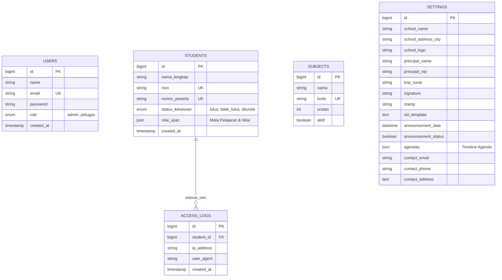

# E-Kelulusan: Sistem Informasi Kelulusan Sekolah

**E-Kelulusan** adalah platform berbasis web modern yang dirancang untuk mendigitalisasi proses pengumuman kelulusan siswa, pencetakan Surat Keterangan Lulus (SKL) secara otomatis, dan manajemen data nilai yang efisien. Sistem ini dibangun menggunakan framework **Laravel 13** dengan antarmuka yang mengadopsi standar **Material Design 3** untuk sisi siswa dan **AdminLTE 3** untuk sisi administrasi.

---

## ✨ Fitur Utama

### 👨‍🎓 Sisi Siswa (Frontend)
- **Cek Kelulusan Real-time**: Pencarian status kelulusan berdasarkan NISN atau Nomor Peserta.
- **Countdown Timer**: Penghitung mundur otomatis hingga waktu pengumuman dibuka.
- **Download SKL Mandiri**: Siswa yang dinyatakan LULUS dapat mengunduh SKL dalam format PDF secara mandiri.
- **Verifikasi QR Code**: SKL dilengkapi dengan QR Code untuk verifikasi keaslian dokumen secara digital.
- **Responsive Design**: Tampilan optimal di semua perangkat (Desktop, Tablet, Mobile).

### 🛠 Sisi Administrator (Backend)
- **Dashboard Analytics**: Statistik cepat mengenai total siswa, persentase kelulusan, dan log akses.
- **Manajemen Siswa & Nilai**: 
    - Import data siswa dan nilai secara masal via Excel.
    - Export data kelulusan ke Excel.
    - Bulk Action: Cetak SKL masal dan hapus data masal.
- **Manajemen Mata Pelajaran**: Pengaturan dinamis mata pelajaran yang muncul di SKL.
- **Pengaturan Identitas Sekolah**: 
    - Upload Logo Sekolah, Kop Surat, Scan Tanda Tangan, dan Stempel.
    - Pengaturan Nama Kepala Sekolah, NIP, dan Format Nomor SKL.
- **Penjadwalan Pengumuman**: Fitur buka/tutup portal secara otomatis berdasarkan tanggal dan jam yang ditentukan.
- **Manajemen Pengguna**: Sistem Role-Based Access Control (Admin & Petugas).
- **Audit Logs**: Mencatat setiap kali siswa mengakses data mereka (IP & User Agent).

---

## 🚀 Teknologi yang Digunakan
- **Framework**: Laravel 13 (PHP 8.3+)
- **Database**: MySQL / MariaDB
- **UI Frontend**: Tailwind CSS, Material Design 3 Components
- **UI Backend**: AdminLTE 3 (Bootstrap 5)
- **Library Utama**:
    - `barryvdh/laravel-dompdf`: Untuk generate PDF SKL.
    - `maatwebsite/excel`: Untuk import/export data Excel.
    - `simplesoftwareio/simple-qrcode`: Untuk generate QR Code verifikasi.
    - `sweetalert2`: Untuk notifikasi interaktif.

---

## 📊 Entity Relationship Diagram (ERD)



---

## 🛠 Instalasi

1. **Clone Repository**
   ```bash
   git clone https://github.com/ozanproject/e-kelulusan.git
   cd e-kelulusan
   ```

2. **Install Dependencies**
   ```bash
   composer install
   npm install
   npm run build
   ```

3. **Konfigurasi Environment**
   - Copy file `.env.example` menjadi `.env`
   - Sesuaikan konfigurasi database di `.env`
   - Jalankan `php artisan key:generate`

4. **Database Migration & Seeding**
   ```bash
   php artisan migrate --seed
   ```

5. **Simlink Storage**
   ```bash
   php artisan storage:link
   ```

6. **Jalankan Aplikasi**
   ```bash
   php artisan serve
   ```

---

## 🔐 Akun Default
- **Admin**: `admin@admin.com` / `password`
- **Petugas**: `petugas@petugas.com` / `password`

---

## ✒️ Maintainer
- **Developer**: Ozan Project
- **Website**: [ozanproject.site](https://ozanproject.site)
- **Lisensi**: MIT License

---
*Dibuat dengan ❤️ untuk kemajuan pendidikan Indonesia.*
